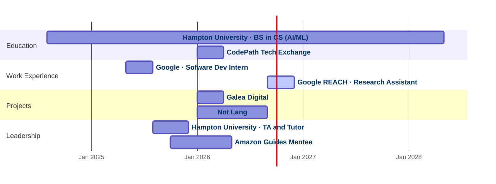

---
tags:
draft: false
created: 2026-09-12T21:10
modified: 2026-09-17T13:11
---
# At a glance

# Education

## Hampton University
Aug 2024 — May 2028

BS Computer Science (AI/ML) · GPA 3.9 · Hampton, VA

Full-Ride Academic Scholarship, Dean's List, and 1st place at the ADMI AI Conference 2026 hackathon.

## CodePath Tech Exchange
Jan 2026 — Apr 2026

Selective project-based exchange program

During the spring semester of my sophomore year, I had the opportunity to take the following courses for credit at my university and be taught by industry engineers through the non-profit organization [CodePath](https://www.codepath.org/impact): Data Structures, Algorithms & System Design with Generative AI; Intro to Software Engineering with Generative AI; Careers in Tech.

Learn more about CodePath [here](https://www.codepath.org/impact).

# Work Experience

## Google · Android XR
May 2025 — Aug 2025

Associate Software Developer Intern · Mountain View, CA

Implemented two new AI-powered user journeys on the Android XR team — front-end in Kotlin and Jetpack Compose, back-end in Java — extending the glasses photography experience. Presented and demoed to stakeholders, directors, and senior engineering managers, and maintained the project documentation covering research, implementation, and architectural decisions.

## Google REACH · SafeGenAI
Sep 2026 — Present

Research Assistant · Remote

Interdisciplinary research across CS, cybersecurity, and psychology. Literature review on generative AI security risks and misuse patterns, plus educational material teaching non-technical audiences to use generative AI responsibly.

# Projects

## Galea Digital
Jan 2026 — Apr 2026

Fitness platform with Gemini API integration

Merged 5 peer-reviewed PRs across 52 tracked issues in a feature-branch workflow. A GitHub Actions CI/CD pipeline gated every deploy behind a pytest suite that blocked 10 failing builds across 6 pull requests. Usability testing surfaced 3 interaction defects, scoped into 9 tickets and shipped as a calorie-goal feature backed by 16 unit tests.

See the GitHub repository for the product [here](https://galea-digital.mieracle.com).

## Not Lang
Jan 2026 — Sep 2026

Full-stack iOS language learning app

I love language learning and am currently learning French. This app, built with SwiftUI and SwiftData, was created to help me learn French slang in context through AI-generated social media posts. To create the content of the posts, I setup a pipeline using the Gemini API, Supabase Edge Functions, and cron scheduling. See the GitHub repository for the project here: [not-lang.mieracle.com](https://not-lang.mieracle.com)

# Leadership & Professional Development

## Hampton University · Teaching Assistant and Tutor
Aug 2025 — Dec 2025

Helped 50+ first-year students master foundational data structures. Weekly 1:1 tutoring focused on debugging and problem-solving, so students could keep going independently after each session.

## Amazon Guides Mentee
Oct 2025 — May 2026

Remote mentorship

Year-long one-on-one mentorship developing career readiness, with networking events alongside CS professionals at Amazon.
